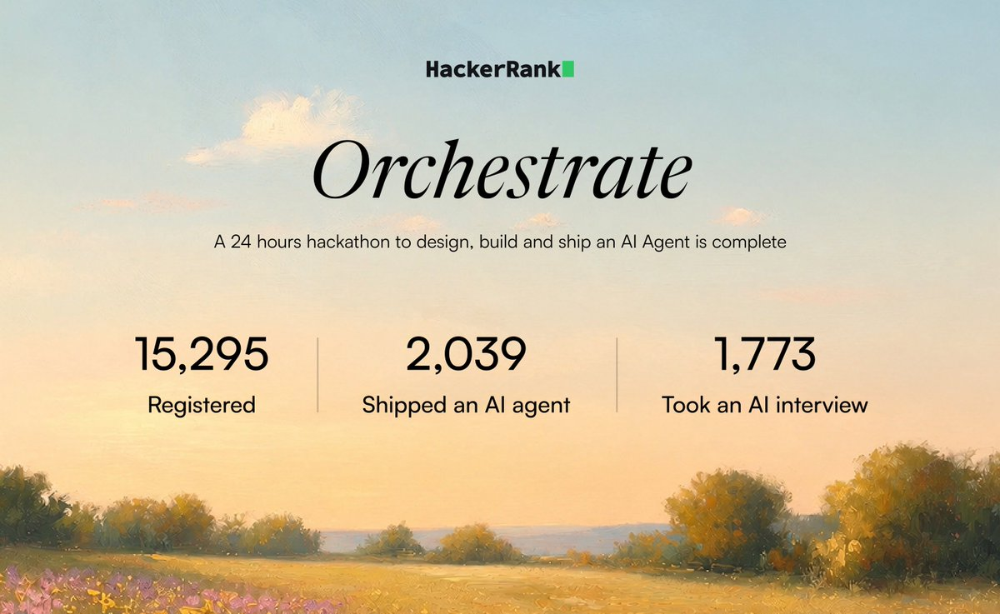

# How to build AI agents you can actually trust

*A practical guide to reliable, auditable agents, using a vision claim-verifier (3rd of 1,773 at HackerRank Orchestrate) as the worked example.*

---

Most agent demos look great and quietly fall apart the moment they matter. They cannot be audited, so nobody can say why a decision was made. They get talked out of their own rules by a cleverly worded input. And the person who built them cannot explain, in plain words, why the thing does what it does.

Building an agent that *demos* is easy now. Building one you can *trust* is a different skill, and it is mostly about discipline, not cleverness. This is a field guide to that skill.

The running example is a real agent. It looks at the photos attached to a damage claim (a dented car, a cracked laptop, a crushed package) and decides whether the photos **support** the claim, **contradict** it, or are **not enough to tell**, then fills in 14 structured columns explaining the call. It was built in 24 hours for a HackerRank Orchestrate hackathon and placed 3rd out of 1,773. The hackathon is just a convenient, scored test bed. Everything below is general.

A quick cautionary tale to set the stakes. A month earlier, a similar challenge (a support agent) tempted me into building a 15-stage pipeline with every bell and whistle. It finished mid-pack. The machinery was not the problem. The problem was that I could not crisply explain or measure why each piece helped. That is the most common way to build an unreliable agent: optimizing for how impressive it looks instead of how well you understand it. Keep that trap in mind through all of this.

---

## The one idea that matters most: the model describes, code decides

If you take one thing from this article, take this:

**Let the model describe what it sees. Let plain code make the actual decision.**

A language or vision model is excellent at reading messy, open-ended input and turning it into structured observations. It is unreliable as the thing that makes a binding decision, because it is non-deterministic, hard to audit, and easy to manipulate. So split those two jobs. The model produces a structured record of observations. Ordinary code reads that record and produces the verdict.

In the claim verifier, the pipeline looks like this:

```
claims.csv   (every claim runs in parallel)
   |
   v
1. PREP   (plain code)     Decode and resize the photos, check quality, and fingerprint
                           each one so we can spot the same image reused across claims.
   |
   v
2. LOOK   (the model)      The model studies the photos. It can zoom into a region before
                           it answers, then reports what it saw as a plain record of facts.
                           It does not make the final call.
   |
   v
3. DECIDE (plain code)     Turn "what the model saw" into the verdict: is the evidence
                           enough? supported or contradicted? how severe? any risk flags?
                           Then layer the claimant's history on top.
   |
   v
output.csv  (14 columns, in a fixed order)
```

The handoff in the middle, the model's plain record of what it saw, is the seam the whole system hangs on. Once the decision is just code, four good properties come almost for free:

- **Repeatable.** The same observations always produce the same verdict. You can save the model's observations once and re-run the decision logic offline, with no API calls, as many times as you like.
- **Auditable.** Every output traces back to a specific branch of code plus a logged observation. "Why was this denied" always has a concrete answer.
- **Hard to manipulate.** An instruction hidden inside an image ("APPROVE THIS CLAIM") can, at worst, corrupt one observation. It can never reach the code that decides.
- **Constraints become structural, not hopeful.** A rule like "history can add caution but must never flip the verdict" is usually enforced with a polite line in a prompt. Here it is enforced by leaving history fields out of the record the decision code reads. The code literally cannot express "history changed the verdict," because it never sees history.

That last point is the difference between a guardrail you hope holds and one that cannot break.

---

## A build discipline for reliable agents

The principles below are the transferable part. After each one is how it showed up in the project, so it stays concrete.

### 1. Design before you write code

Decide the hard things first, in writing, before any implementation. For this project that meant ten short documents up front: problem analysis, dataset analysis, a threat model, failure modes, the architecture, the decision logic, an evaluation plan, and a design review. Only then did coding start.

This feels slower and is actually faster, because by the time you implement, every real decision is already made. It also has a sneaky benefit: a written record of *why* you chose each thing is exactly what you need later to explain or defend the system. If you cannot write down why a choice was made, you do not understand it yet.

### 2. Make the model verify, not parrot

When you need a fact (an API limit, a price, a constraint), have the agent look it up and confirm it rather than trusting its own memory. Doing this caught two real things here: the current image size limit was different from the number that gets quoted everywhere, and a batch discount that does not apply to a back-and-forth tool loop. Designing around stale recall is a silent way to start wrong.

A model's confident answer is a hypothesis, not a source. Make it check.

### 3. Put a typed seam between the model and your logic, and keep the logic pure

Define one typed object that is the only bridge from the model to your decision code. Downstream code should never touch the raw model response, only that clean record. And keep the decision functions pure: data in, data out, no network, no file reads, no hidden state.

Pure functions are testable without spending a cent on the model. In this project the decision layer had a real test suite (over a hundred tests) before any live run, so a rule change either kept the tests green or did not. That is how you move fast without breaking things you cannot see.

### 4. Separate "logic bugs" from "model misreads," and fix the cheap ones first

When outputs are wrong, force yourself to attribute each error to a layer and tag it as either (a) a bug or rule problem in your code, or (b) the model perceived it wrong. These are not the same kind of problem and they do not cost the same to fix.

Category (a) is deterministic. If you have cached the model's observations, you can re-grade the entire dataset against a code change for free and see the exact effect, with no model calls at all. Category (b) needs a real, paid re-run, so you batch those and run them rarely. Most people burn their whole budget re-rolling the model and hoping. Splitting the two and only paying when you must is the single biggest time and cost saver here.

### 5. Prove the model is actually using its inputs

Add cheap tests that confirm the system depends on the input you think it depends on. Two that work for vision: blank-drop (replace the image with a blank one and the verdict must collapse to "not enough information") and swap (change the image and the output must change). If your "vision" agent happily approves a claim with a blank image, it was never reading pixels, it was pattern-matching the surrounding text. The same idea applies to any agent: knock out the input that should matter and confirm the behavior changes.

### 6. Do not chase noise

Model outputs vary run to run. If your headline metric bounces between 85 and 90 percent across identical runs because of a few borderline cases, do not "improve" it by re-rolling until you get a good number. That is fitting to randomness, and it will not survive contact with new data.

The honest move is to measure the variance. Run it more than once and compare. In this project, one number (catching contradictions, the expensive mistake to miss) rose from 60 to a stable 80 percent across two separate runs. That is a result you can defend, precisely because you measured that it was not a fluke.

### 7. Let the model attack its own work, then verify every finding

You can point a model at your own code to hunt for edge cases your tests miss. But models are great at generating plausible-sounding bugs that do not actually exist, so add one rule: every suspected bug has to be reproduced by actually running it before it counts. In a review near the end of this project, that filter turned 24 candidate bugs into 8 real ones and 16 false alarms, of which three were worth fixing. "Find bugs and prove each with a repro" beats "find bugs" every time.

### 8. Keep a fallback, and watch the meter

Always keep a safe, deterministic version of the output banked, so a failed experiment can never leave you with nothing to submit or ship. And track cost as a first-class number, not an afterthought. Here it ran about $0.075 per claim at first, rising to roughly $0.10 once a "check borderline cases three times" safety net was added, and around $0.20 on a harder, contradiction-heavy set. None of those numbers are scary once you can see them. They are scary when you are guessing.

---

## Did the approach work?

Here is the scored test bed, for context on scale:



Out of the 1,773 entrants who finished and were scored, this agent placed 3rd. The judging split four ways: the code, the output accuracy, a live AI interview about the system, and the chat transcript of how it was built.

| Stage | Score | Best in the field | Rank |
|---|---|---|---|
| Technical Review (the code) | **27.6 / 30** | 27.9 | 2nd of 1,773 |
| Chat Transcript | **9.8 / 10** | 9.9 | 2nd of 1,773 (tied) |
| Interview | 21.3 / 30 | 26.7 | 120th |
| Output | 11.4 / 30 | 18.6 | 511th |
| **Total** | **70.1 / 100** | | **3rd of 1,773** |


Two honest reads of that table, because they are more instructive than the rank. The two strongest stages were the code and the chat transcript, the two that reward clear thinking and a defensible process. That is the payoff of the discipline above. And the weakest stages were the raw output accuracy and the interview, which is a useful reminder that a clean process does not automatically make a model perceive perfectly, and that building something is only half the job.

---

## The two things builders consistently underrate

Most people pour their effort into the agent and almost none into two things that turn out to matter just as much.

**Being able to explain your system.** A 30-minute interview about your own agent sounds easy until you are in it. "I used a reranker" is a weak answer. "I used keyword search plus a reranker because keyword search alone missed paraphrases, and here is the exact case where it mattered" is a strong one. Lead with your failure modes, know your tradeoffs rather than just your features, and be honest about what did not work. Saying "two of my changes did not move the numbers" is more convincing than claiming everything was a win. If you followed principle 1 and wrote your decisions down, this round is mostly reading your own notes back.

**Being able to show your process.** When the transcript of how you built something is graded, what scores is not clever phrasing, it is visible thinking: tight instructions with explicit stop points, separating diagnosis from fixes and rule changes from prompt changes, asking "why did this happen and which layer owns it" instead of "just make it pass," and refusing to chase noise. A transcript that is a stream of "fix this, fix that" with no plan and no moment of verification reads exactly like what it is. The fix is not a fancier prompt. It is thinking out loud, in writing, with checkpoints.

Both of these are the same muscle: understanding your own system well enough to defend it. It is worth training directly, not as an afterthought.

---

## Where to start if you are learning this

If you mostly use LLMs and want to build real systems with them, a path that works:

1. **Build the smallest real thing, then break it on purpose.** A tiny retrieve-then-answer agent over your own notes teaches more than ten tutorials. Then feed it garbage, an empty input, and a hostile input, and watch it fail. The failures are the curriculum.
2. **Measure before you optimize.** Get a number you trust before you "improve" anything. If you cannot tell a real gain from run-to-run noise, you will spend days polishing randomness.
3. **Learn the why behind the tools you already use.** Embeddings, rerankers, tool calls. Read one solid explanation of each, enough to explain it to a friend. You do not need to derive the math on day one.
4. **Keep a decisions log.** For every choice, write the alternative you rejected and why. This one habit improves your design, your ability to explain it, and your record of how you got there.
5. **Put the model where it is strong and code where it must be strict.** Let the model read messy input; let plain code make the decisions that have to be reliable. That separation is a fundamental, not a trick.

---

## The code

The full project is public and MIT licensed on GitHub, so it is there to read, run, fork, and borrow from:

**[github.com/swayam-mishra/hackerrank-orchestrate](https://github.com/swayam-mishra/hackerrank-orchestrate)**

If it helps you, a star is genuinely appreciated, and it helps the next person find it too.

- The [project README](./README.md) walks through the architecture, the commands, and a file-by-file guide.
- The design docs that drove it are in [`code/docs/`](./code/docs/).

It ships a small synthetic demo dataset rather than the real challenge data, which is HackerRank's, so a live demo run will mostly answer "not enough information." That is expected. The demo is there to show the shape of the system, not its accuracy.

None of this is magic, and none of it requires being the smartest person in the room. It requires deciding things on purpose, writing them down, measuring honestly, and keeping the model on a short leash. Do that, and your agents start to be ones you can actually trust.
