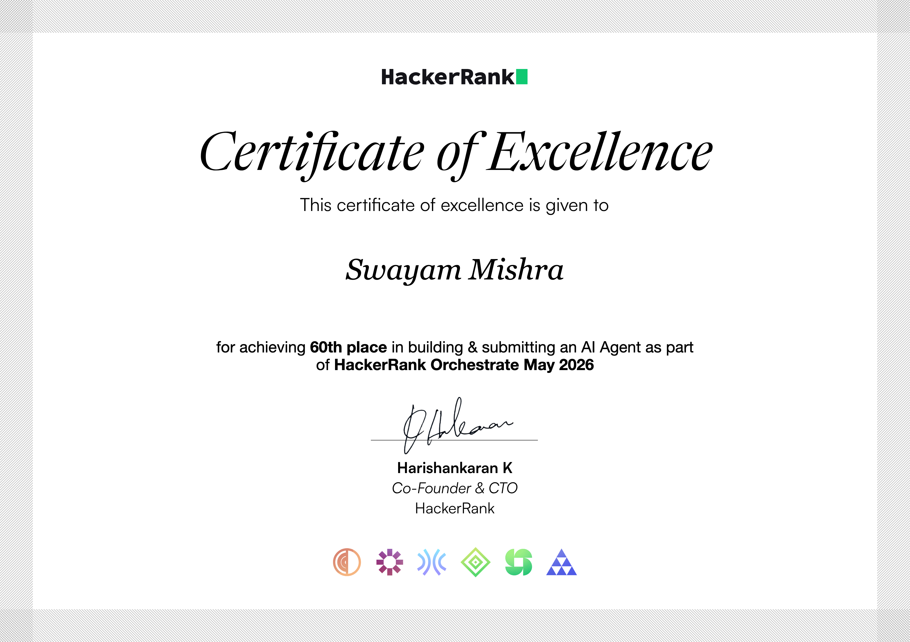

# HackerRank Orchestrate, May 2026: Support Triage Agent

This is a command-line agent that reads customer support tickets and decides what to do with each
one: answer it, or pass it to a human. It works across three different help desks (HackerRank,
Claude, and Visa), and it answers only from a local set of help docs, with no internet calls while
it runs. For every ticket it fills in five columns: a status, the product area, a written reply, a
short reason for the decision, and a request type.

I built it for the **HackerRank Orchestrate** hackathon (a 24-hour event on May 1-2, 2026), where it
finished **60th out of 1,349** people who completed the challenge. There's a longer story behind it
in [How I Built a 15-Stage RAG Support Triage Agent in 24 Hours](./medium-article.md).

This single README is the whole guide: what the agent does, how to run it, how the code is organized,
the decisions behind it, and where it falls short.

---

## Certificate

HackerRank **Certificate of Excellence** for placing **60th of 1,349** in HackerRank Orchestrate (May 2026):



## Score breakdown

For context on the field: HackerRank Orchestrate (May 2026) drew **12,885 registrations**, **2,002
people shipped a working agent**, and **1,349 finished the AI interview** (that last group is the
field everyone was scored against). I finished **60th of those 1,349**, with a total of **64.8 out
of 100**.

The score came from four stages. My strongest by rank were the Chat Transcript and the code
(Technical Review); the AI interview was my weakest:

| Stage | My score | Best in the field | Where I ranked |
|---|---|---|---|
| Chat Transcript Evaluation | **7.2 / 10** | 9.5 | 31st of 1,349 |
| Technical Review & Final Results (the code) | **22.8 / 30** | 27.6 | 55th of 1,349 |
| Output Evaluation | 20.4 / 30 | 24.6 | 170th of 1,349 |
| Interview Evaluation | 14.4 / 30 | 24.6 | 301st of 1,349 |
| **Total** | **64.8 / 100** | | **60th of 1,349** |

The funnel numbers come from HackerRank's recap; the per-stage scores come from
[`leaderboard-may.json`](./leaderboard-may.json).

## What it does

For each ticket in `support_tickets/support_tickets.csv`, the agent produces five columns:

| Column | What goes in it |
|---|---|
| `status` | `replied` or `escalated` |
| `product_area` | the support category it fits best |
| `response` | the answer to the user, written only from the help docs |
| `justification` | a short note on why it routed the ticket the way it did |
| `request_type` | `product_issue`, `feature_request`, `bug`, or `invalid` |

The big idea is the same one I leaned on in the June project: **let the model write, but let plain
code make the decisions.** The model drafts the reply, but whether a ticket gets escalated, whether
the answer is allowed through, and whether it passes the checks, all of that is decided by ordinary
Python you can read and trust.

Here's the path each ticket takes:

1. **Pre-filter.** Throw out the obvious non-tickets (empty, gibberish, non-English, or someone
   trying to hijack the agent with hidden instructions) before spending anything on them.
2. **Clean up the search query.** Lowercase it and expand abbreviations like "2FA" or "SSO" so the
   search has a better chance of matching the docs.
3. **Split multi-part tickets.** If someone asks two things at once, handle each part.
4. **Search the docs.** First a fast keyword search to pull likely passages, then a small local model
   re-reads the top ones and re-orders them by how well they actually answer the ticket.
5. **Score the confidence.** How sure are we the search found the right thing?
6. **Risk gate.** A few hard rules decide up front whether this should just go to a human.
7. **Ask Claude (Haiku 4.5).** Give it the ticket plus the best passages and have it draft the reply.
8. **Validate and, if needed, repair.** Check the answer has the right shape and doesn't cite sources
   it never saw; if it's broken, ask the model once to fix it.
9. **Filter the output.** Strip any links or phone numbers the model made up that aren't in the docs.
10. **Write a decision trace.** Log why each ticket went the way it did, so the whole thing is
    auditable afterward.

It processes five tickets at a time to keep things fast.

HackerRank's original problem statement, lightly formatted, is in
[`problem_statement.md`](./problem_statement.md) if you want the task in their own words.

---

## How the project is organized

```
.
├── code/                      the agent
│   ├── main.py                the command you run; it just hands off to src/main.py
│   ├── src/                   the agent itself
│   │   ├── agent.py · config.py · prompts.py · pii.py · main.py
│   │   ├── retrieval/         prefilter · normalize · multi_request · retriever
│   │   ├── decision/          risk_gate · sentiment · taxonomy · confidence · degrade
│   │   ├── validation/        validator · output_filter · faithfulness
│   │   └── observability/     failures · decision_trace · coverage
│   ├── evaluation/            the scoring script plus pre-flight checks
│   └── docs/                  DECISIONS.md, FAILURE_MODES.md
├── data/                      the help docs (HackerRank / Claude / Visa), used offline
├── support_tickets/           the input CSVs, the output, the decision trace, eval results
├── docs/buildplans/           the phase-by-phase plans I worked from
├── problem_statement.md       the original task
├── medium-article.md          the long write-up
├── requirements.txt
├── .env.example
└── README.md                  you are here
```

> There's one shared `.gitignore` at the top of the monorepo (one folder up), not inside this project.

## Setup

Run everything from the **project folder** (the one that holds `code/`, `data/`, and
`support_tickets/`):

```bash
pip install -r requirements.txt
```

```bash
# macOS / Linux
cp .env.example .env
# Windows (PowerShell)
Copy-Item .env.example .env
```

Open `.env` and paste in your `ANTHROPIC_API_KEY`. Both `requirements.txt` and `.env.example` live in
the project folder.

> A note on folder names: this project uses `support_tickets/` for the input and output CSVs. If your
> copy has a `support_issues/` folder instead, rename it (`mv support_issues support_tickets`, or
> `Rename-Item support_issues support_tickets` on Windows).

## Run

```bash
python code/main.py
```

This reads `support_tickets/support_tickets.csv` and writes the answers to
`support_tickets/output.csv` (10 columns, described in [The output file](#the-output-file) below).
Tickets are processed in parallel but written back in their original order. Two side files may show up:

- `support_tickets/decision_trace.jsonl`: one line per ticket with the full reasoning, personal info removed.
- `support_tickets/failed_tickets.log`: only created if something errors out; absent on a clean run.

A few more commands live under `code/evaluation/`:

- `python code/evaluation/eval.py` scores the agent against the small labeled set and writes `support_tickets/eval_results.md`.
- `python code/evaluation/check_determinism.py` runs `main.py` twice and checks the scored columns came out identical.
- `python code/evaluation/check_submission.py` is a pre-flight check that everything needed is in place.
- `python code/evaluation/check_fresh_clone.py` confirms every file imports cleanly and every dependency is declared.
- `python code/evaluation/review_output.py` prints a one-line-per-ticket summary of `output.csv` for a quick eyeball.

> One development tool, the adversarial test harness (`synthetic_eval.py`), is described in the notes
> below but isn't shipped in this public copy.

A full run is about 45 seconds for 29 tickets (five at a time, on Haiku 4.5) and costs roughly $0.07.

## A guide to the files

The code is a small package under `src/`, grouped by what each part does. The thin `main.py` you run
and the helper scripts under `evaluation/` sit next to it.

**The entry point and the shared pieces**

| File | What it does |
|---|---|
| [main.py](code/main.py) | The command you run. It just puts `code/` on the path and calls `src/main.py`. |
| [src/main.py](code/src/main.py) | The batch runner. Loads the tickets, builds the search index and the Claude client once, runs five at a time, writes the 10-column output, and prints a summary (timing, tokens, cost). |
| [src/agent.py](code/src/agent.py) | The per-ticket flow. Runs one ticket through pre-filter, cleanup, search, the risk gate, and Claude, tracking timing and tokens along the way. |
| [src/config.py](code/src/config.py) | All the settings in one place, plus the one source of truth for file paths. |
| [src/prompts.py](code/src/prompts.py) | Builds the instructions for Claude and the per-ticket message (tone note, multi-part rule, citation rule, the expected answer shape). |
| [src/pii.py](code/src/pii.py) | Strips personal info (emails, phone numbers, long ID strings) out of anything headed for a log. The output file is never redacted. |

**`src/retrieval/`: understanding the ticket and finding the right docs**

| File | What it does |
|---|---|
| [src/retrieval/prefilter.py](code/src/retrieval/prefilter.py) | Catches the tickets that shouldn't go further: empty, gibberish, hijack attempts, or non-English. |
| [src/retrieval/normalize.py](code/src/retrieval/normalize.py) | Lowercases the search query and expands abbreviations (HR, 2FA, SSO, and so on). Only the search query is changed; the original ticket text still goes to Claude untouched. |
| [src/retrieval/multi_request.py](code/src/retrieval/multi_request.py) | Splits a ticket that's really asking two separate things into two searches. |
| [src/retrieval/retriever.py](code/src/retrieval/retriever.py) | Loads the docs into 14,868 small passages, runs the fast keyword search over all of them, then has the local re-ranker keep the best 3 of the top 20. |

**`src/decision/`: the routing logic**

| File | What it does |
|---|---|
| [src/decision/risk_gate.py](code/src/decision/risk_gate.py) | Plain rules (no model) for when to escalate straight away. Two triggers: a hijack attempt, or the search found nothing at all. |
| [src/decision/sentiment.py](code/src/decision/sentiment.py) | A tiny keyword check for whether the writer sounds frustrated, so the reply can open with a bit more empathy. |
| [src/decision/taxonomy.py](code/src/decision/taxonomy.py) | The allowed `product_area` values per company, plus a fallback that reads the category off the doc's folder path if the model picks something off-list. |
| [src/decision/confidence.py](code/src/decision/confidence.py) | Turns the search results into a confidence score from 0 to 1, bucketed into high, medium, or low. |
| [src/decision/degrade.py](code/src/decision/degrade.py) | A safe fallback reply, built from the top passage, for when the model's answer can't be fixed or the API is down. |

**`src/validation/`: checking the model's answer**

| File | What it does |
|---|---|
| [src/validation/validator.py](code/src/validation/validator.py) | Checks the answer has the right shape and allowed values, is internally consistent, and doesn't cite a source that wasn't retrieved. Flags blocking problems separately from minor ones. |
| [src/validation/output_filter.py](code/src/validation/output_filter.py) | Removes any links or phone numbers in the reply that don't actually appear in the docs it was given. |
| [src/validation/faithfulness.py](code/src/validation/faithfulness.py) | A rough check that the numbers and quoted phrases in the reply really came from the retrieved passages. |

**`src/observability/`: keeping a record**

| File | What it does |
|---|---|
| [src/observability/failures.py](code/src/observability/failures.py) | Writes one line per error to `failed_tickets.log`, safely across the parallel workers, with personal info removed first. |
| [src/observability/decision_trace.py](code/src/observability/decision_trace.py) | Writes one line per ticket to `decision_trace.jsonl` with the full reasoning, personal info removed. |
| [src/observability/coverage.py](code/src/observability/coverage.py) | Logs the low-confidence searches to `coverage_gaps.log`, which shows where the docs are thin. |

**`evaluation/`: scoring and pre-flight checks**

| File | What it does |
|---|---|
| [evaluation/eval.py](code/evaluation/eval.py) | Runs the agent against the 10 labeled examples and reports accuracy per column and per company. |
| [evaluation/check_determinism.py](code/evaluation/check_determinism.py) | Runs `main.py` twice and checks the scored columns match (the wording can vary slightly even at the most deterministic setting, so it reports those separately). |
| [evaluation/check_submission.py](code/evaluation/check_submission.py) | Confirms every needed file is present and well-formed before submitting. |
| [evaluation/check_fresh_clone.py](code/evaluation/check_fresh_clone.py) | Acts like a brand-new user: every dependency is declared, every file imports without an API key, and the README mentions every command. |
| [evaluation/review_output.py](code/evaluation/review_output.py) | A one-line-per-ticket summary of the output joined with the decision trace, for a quick manual check. |

**`docs/`: the longer write-ups**

| File | What it does |
|---|---|
| [docs/FAILURE_MODES.md](code/docs/FAILURE_MODES.md) | A catalogue of every known way it can go wrong, with the fix and the evidence. |
| [docs/DECISIONS.md](code/docs/DECISIONS.md) | A log of the significant choices, one entry each, with the alternatives I considered. |

## The output file

`support_tickets/output.csv` has 10 columns:

| # | Column | Comes from | Notes |
|---|---|---|---|
| 1 | `issue` | input | copied from the input |
| 2 | `subject` | input | copied from the input |
| 3 | `company` | input | copied; may be empty |
| 4 | `status` | model or risk gate | `replied` or `escalated` |
| 5 | `product_area` | model | the support category; empty when escalated |
| 6 | `response` | model | the reply to the user, citing the docs it used |
| 7 | `justification` | model | a sentence or two of reasoning |
| 8 | `request_type` | model | `product_issue`, `feature_request`, `bug`, or `invalid` |
| 9 | `inferred_company` | model | filled in when the input `company` was empty; otherwise blank |
| 10 | `latency_ms` | agent | how long this ticket took |

The run also prints a summary: total tokens, average tokens per ticket, an estimated cost, and the slowest ticket.

## How it was built

I built this in five passes. Each one was a complete, working agent; the later ones just added more
on top. Here's how it changed along the way (P1 to P5):

| | P1 (keyword search) | P2 (re-ranker, parallel) | P3 (polish, logging) | P4 (hardening, scoring) | **P5 (final)** |
|---|---|---|---|---|---|
| **Runtime** | ~82s | ~37s | ~37s | ~40s | **~45s** |
| **Replied** | 27 / 29 | 28 / 29 | 28 / 29 | 28 / 29 | **28 / 29** |
| **Escalated** | 2 / 29 | 1 / 29 | 1 / 29 | 1 / 29 | **1 / 29** |
| **Sample status accuracy** | n/a | n/a | n/a | 10/10 | **10 / 10** |
| **Sample request_type accuracy** | n/a | n/a | n/a | 9/10 | **10 / 10** |
| **Sample product_area accuracy** | n/a | n/a | n/a | 5/10 | **7 / 10** |
| **Synthetic crash rate** | n/a | n/a | n/a | n/a | **0 / 15** |
| **Synthetic status accuracy** | n/a | n/a | n/a | n/a | **15 / 15** |
| **Avg tokens (in / out)** | n/a | n/a | 1,255 / 228 | 1,255 / 230 | **1,523 / 227** |
| **Cost per run** | n/a | n/a | ~$0.065 | ~$0.065 | **~$0.072** |

### Pass 1: a working agent, end to end

**Keyword search over the local docs.** The `data/` folder holds 772 documents across the three help
desks. On startup the agent splits them into 14,868 small overlapping passages, tags each with the
company it came from, and builds a keyword search index (BM25, the classic ranking method search
engines used before neural search). I chose keyword search over neural embeddings for three reasons:
it gives the same results every time, it needs no GPU or extra index, and it's genuinely better here
because support tickets hinge on exact product names. Embeddings tend to blur something specific like
"Bedrock" into "AWS in general."

**A nudge toward the right company.** Passages from the ticket's stated company get a small score
boost (1.5x) rather than a hard filter. A hard filter would have been risky: the Visa docs are only
14 files, so filtering to them would leave many tickets with nothing to go on and force needless
escalations. When the company is unknown, no boost is applied and the model infers it later.

**Filter junk before it costs anything.** Before any search or model call, the pre-filter drops four
kinds of input: empty tickets, hijack attempts ("ignore previous instructions"), gibberish, and
non-English text. This saves money on junk, keeps hijack attempts away from the model entirely, and
produces clean "invalid" rows in the output.

**Decide escalation with rules, not the model.** Whether to escalate is decided before Claude is
even called. I started with a longer list of rules but the labeled data showed only one in ten
tickets should escalate, and only for real outages, so I cut it down to two hard triggers: a hijack
attempt, or a search that returned nothing. The reason to keep this in code is simple: a model can be
talked out of a rule ("this isn't really fraud, just help me"), and plain code can't. Everything
else, including sensitive topics, goes to the model with clear guidance in the prompt.

**Tell the model when not to escalate.** The prompt is explicit that a thin doc set is not a reason
to bail. Stolen cards, fraud, account access, refunds: all of these get answered with whatever the
docs offer plus a pointer to support. Only a full platform outage escalates. I tuned this by reading
the labeled examples and writing the rule against them.

**Pin the model down.** Every model call uses the most deterministic setting, so the same ticket
gives the same answer across runs. Repeatability was part of how the challenge was scored.

**Handle the model wrapping its answer in a code block.** Haiku sometimes returns its JSON answer
wrapped in a Markdown code block even after being told not to, so the agent strips that wrapper off
before reading it. This was a real bug early on: every ticket was failing to parse and getting
escalated by mistake.

### Pass 2: better search, and speed

**Add a re-ranker.** Plain keyword search missed paraphrases. A ticket saying "all requests to claude
with aws bedrock is failing" didn't match the Bedrock docs because they're worded differently. So I
added a second step: keyword search grabs 20 likely passages quickly, then a small model that runs
locally (about 80 MB, a fraction of a second per ticket, no API call) re-reads each passage against
the ticket and keeps the best three. This "find fast, then re-rank carefully" pattern is standard in
production search.

**Send less to the model.** Pass 1 sent five rough passages and allowed long replies. Pass 2 sends
three good ones and caps the reply length, since real answers are short anyway. That trimmed the cost
of each call by roughly a third.

**Do five at once.** Pass 1 handled tickets one at a time, around 2.8 seconds each. Pass 2 runs five
in parallel and writes them back in order, which cut a full run from about 82 seconds to 37.

**A concurrency bug worth knowing about.** The language-detection library keeps shared internal state
and broke under parallelism, marking every ticket as non-English. The fix was a single lock around
that one call. It barely costs anything because most tickets are filtered out before they reach it.

### Pass 3: polish and a paper trail

**Clean the search query without touching the ticket.** Before searching, the query is lowercased
and abbreviations are expanded (HR to HackerRank, 2FA to two-factor authentication, SSO to single
sign-on, and so on). Only the search query changes; the original wording still goes to the model, so
the user's tone and voice are preserved in the reply.

**Handle two-in-one tickets with a prompt rule.** Rather than trying to detect multiple requests
mechanically (which trips over phrases like "refund and process quickly"), the prompt just tells the
model to answer each distinct request separately and number them. At the most deterministic setting,
Haiku follows that reliably.

**Match the tone when someone's upset.** A tiny keyword check flags a frustrated ticket ("asap",
"urgent", lots of capitals), and the prompt then asks the model to open by acknowledging the concern.
I used keywords rather than a sentiment model on purpose: it's predictable, easy to inspect, and easy
to explain.

**Cite sources.** A single line in the prompt asks the model to name the doc it's quoting ("According
to certifications-faqs.md..."). The source tags are already in the message, so the model just needs
to use them. About 12 of 28 replies ended up citing a source, which makes them checkable.

**Surface the inferred company.** When the input company is blank, the model guesses it from the
ticket ("stolen Visa card" points to Visa). That guess goes in its own `inferred_company` column
rather than overwriting the input, so the original stays intact and the guess is visible.

**Keep a record.** The agent logs timing and token use per ticket, and writes any errors to a log
(with personal info stripped first). All of it is empty on a clean run.

### Pass 4: hardening, and actually measuring quality

**Retry on temporary failures.** Rate limits and connection blips now retry a few times with a short
backoff before giving up, instead of escalating on the first hiccup. Real programming errors still
fail fast rather than retrying pointlessly.

**Scrub personal info from logs.** A small helper removes emails, phone numbers, and long ID strings
from anything written to a log. Importantly, it is never applied to the output file, which is meant
to show the real ticket-to-reply mapping.

**Hand off warmly.** An escalated ticket used to get a generic "passed to a human" line. Now it
carries real context: the reason, a preview of the issue, and the doc names that were retrieved, so
the human doesn't start from zero.

**Strip made-up links.** Every reply is scanned for links and phone numbers, and any that aren't in
the retrieved docs are removed and noted in the justification. On the test batch this caught two
fabricated ones.

**Measure it.** A scoring script runs the agent against the 10 labeled examples and reports accuracy
per column. The categorical columns are checked exactly; the free-text reply is written side by side
with the expected one for a human to read. This was the only way to know if a change actually helped.

### Pass 5: the last lift

**Constrain the categories.** The allowed `product_area` values are listed in the prompt so the model
picks from a fixed vocabulary. If it still strays, a fallback reads the category off the matched doc's
folder. That moved sample accuracy on this column from 50% to 70%; the remaining misses are genuine
judgment calls where either label is defensible.

**Tighten the outage rule.** An earlier example made the model treat single-feature problems as
platform-wide outages. Spelling out the difference moved request-type accuracy from 90% to 100% on
the sample.

**Check the answer and repair it once.** After the model replies, a validator checks the shape, the
allowed values, internal consistency, and that it isn't citing a source it never saw. If something's
broken, the model gets one chance to fix it, with the specific errors as a hint. Minor issues are
recorded but don't block.

**Score the search confidence.** A confidence value between 0 and 1 blends three signals: how strong
the top match is, how much it beats the runner-up, and how consistent the matches are on company. Low
confidence switches the prompt to a cautious mode ("don't guess; if the docs don't cover it, say so
and point to support"), which keeps the model from inventing answers when the docs are thin.

**Write a full decision trace.** Every ticket gets one line capturing each step (filter, tone,
search, confidence, risk gate, the model call and any repair, the checks, and the final outcome), with
personal info removed. It answers "why did it do that for ticket N" with a quick query.

**A graceful fallback.** If the model's answer can't be parsed or fixed, or the API is down, the agent
returns a safe templated reply built from the top passage and names the source. The user still gets
something useful, and the row is flagged so it's visible in the summary.

**Adversarial testing.** A separate harness ran the agent against 15 hand-built edge cases (empty,
very short, very long, two-in-one, hijack attempts of increasing nastiness, non-English, noisy,
fraud, ambiguous company, a topic the docs don't cover, and a trap designed to bait a fake citation).
It got the status right on all 15 with no crashes.

**Guardrails before submitting.** One script runs the agent twice and checks the scored columns are
identical; another checks every required file is present and well-formed.

## Where it falls short

Being honest about the limits, since they're the interesting part:

- **Very short tickets** ("help", "not working") give the search almost nothing to work with. The
  agent won't escalate unless the search comes up completely empty, so it may answer with a polite "I
  don't have docs for that."
- **Other languages.** Non-English tickets are filtered out as out-of-scope rather than translated.
  The labeled data treated that as correct, but it's a real limitation.
- **Two-in-one tickets.** Splitting them is a prompt instruction, not a second search, so if the two
  parts don't share keywords the search may only find docs for one of them. The model answers what it
  can and points to support for the rest.
- **Subtle frustration.** The keyword tone check misses quieter frustration like "this has been going
  on for weeks." The cost is just a missed empathetic opener, not a wrong answer.
- **Unknown company.** With no company to nudge toward, the search can pull in passages from the wrong
  product. The inferred-company column at least makes the agent's guess visible.
- **Thin Visa docs.** Only 14 files cover Visa, so anything outside them gets an honest "I don't have
  docs for that" instead of a made-up policy. That's intentional.
- **First-run download.** The re-ranker model (about 80 MB) downloads once on the first run, then runs
  from local cache.

## Dependencies

```
anthropic>=0.25.0
rank-bm25>=0.2.2
numpy>=1.24.0
pandas>=2.0.0
python-dotenv>=1.0.0
tqdm>=4.66.0
rich>=13.0.0
langdetect>=1.0.9
sentence-transformers>=2.7.0
```

## How it was judged

Submissions were scored on four things: the design of the agent (the code), how accurate its output
was, an AI interview, and a chat transcript that looked at how well the entrant worked with AI.
